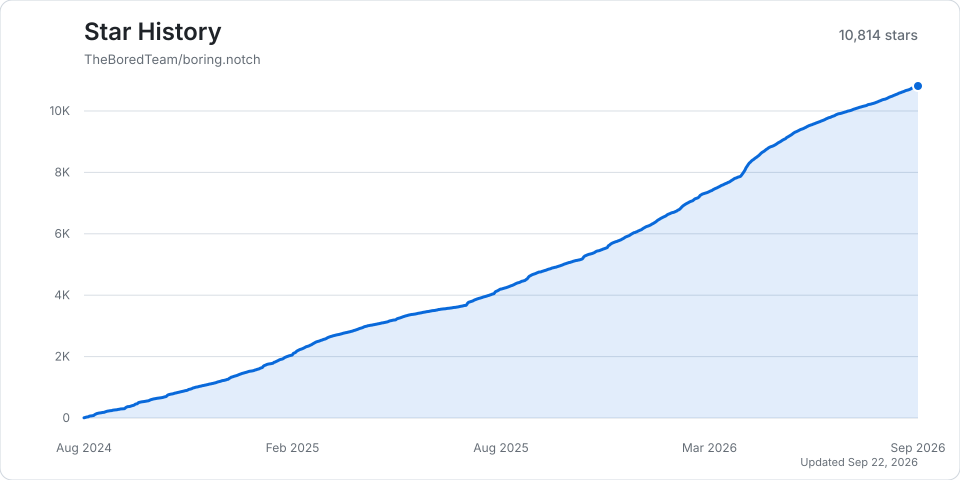

# org-star-chart-updater

This repository contains a scheduled GitHub Actions workflow that records star history for a selected list of `TheBoredTeam` repositories and publishes static charts for each project.

<p align="center">
  <picture>
    <source media="(prefers-color-scheme: dark)" srcset="projects/boring.notch/chart-dark.svg">
    <source media="(prefers-color-scheme: light)" srcset="projects/boring.notch/chart-light.svg">
    
  </picture>
</p>

## Adding repositories

Edit the shared list in `.github/workflows/update-stars.yml`:

```yaml
env:
  STAR_HISTORY_OWNER: TheBoredTeam
  STAR_HISTORY_REPOSITORIES: |
    boring.notch
    another-project
```

Each line is a repository name from the configured organization. The GitHub App must be installed on every listed repository. The workflow passes this same list to the App token and the local updater, so adding a repository requires no per-project configuration file.

## Generated files

For every listed repository, the updater writes:

- `projects/<repository>/data.json` — versioned daily cumulative star data.
- `projects/<repository>/chart-light.svg` — light-theme chart.
- `projects/<repository>/chart-dark.svg` — dark-theme chart.

The updater fetches stargazer timestamps from GitHub, rebuilds the history, and commits changed files on its schedule or when manually dispatched.

## Credits

The chart presentation is inspired by [star-history.com](https://www.star-history.com/) and the open-source [star-history/star-history](https://github.com/star-history/star-history) project.

The updater implementation is adapted from the MIT-licensed [esengine/DeepSeek-Reasonix](https://github.com/esengine/DeepSeek-Reasonix) project. The applicable upstream notice is preserved in [THIRD-PARTY-NOTICES.md](THIRD-PARTY-NOTICES.md).
